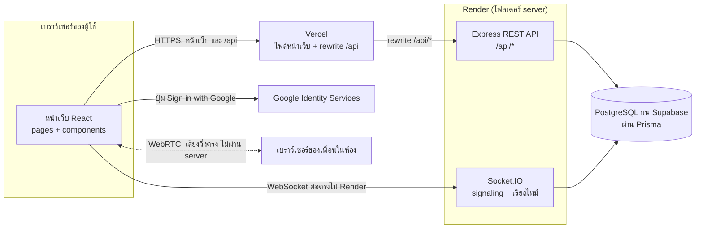
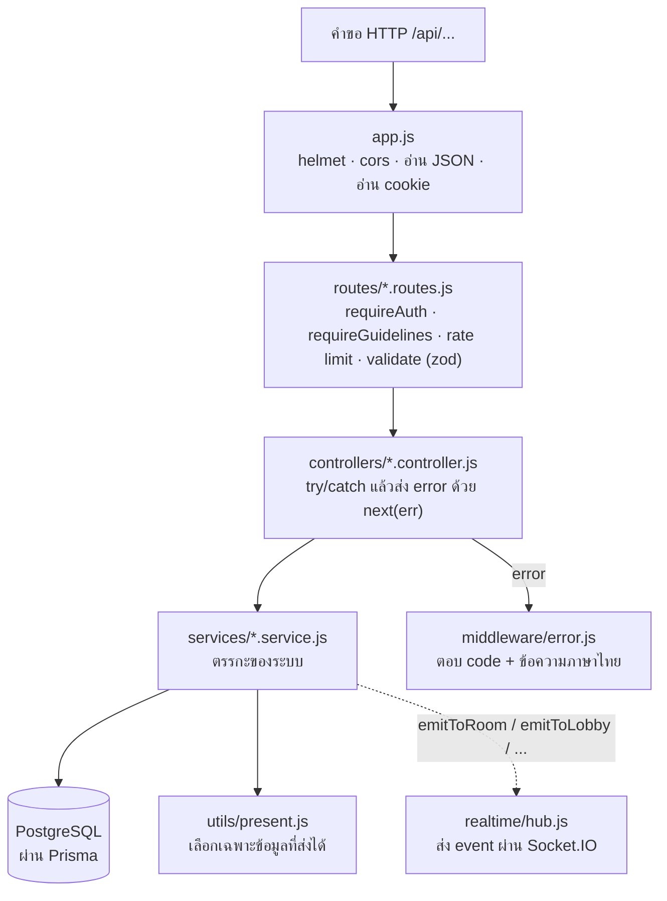
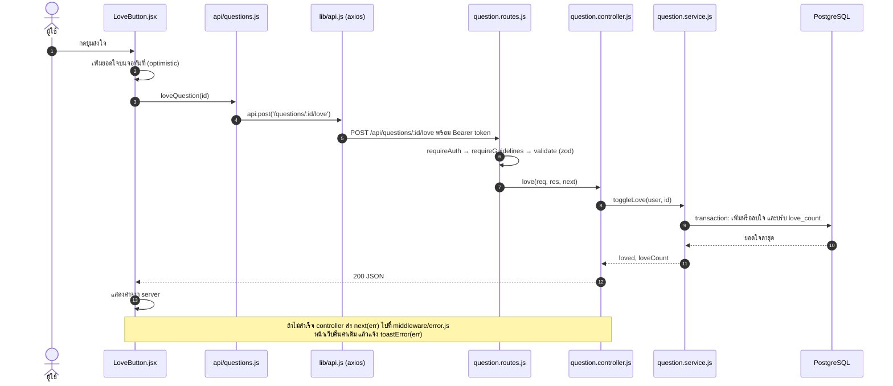
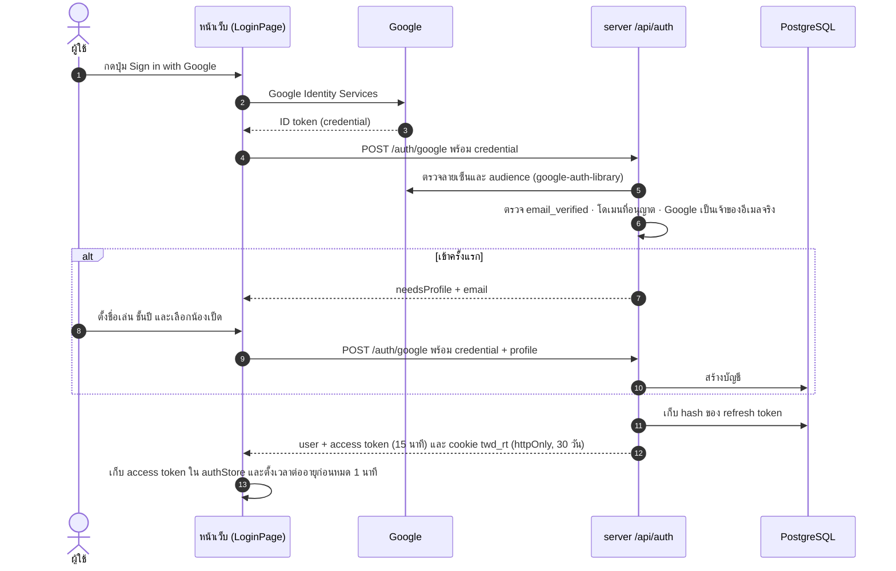
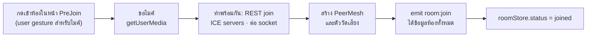

# สถาปัตยกรรมระบบ (ข้อ 3.5.2–3.5.7)

เอกสารนี้อธิบายว่าโค้ดแต่ละส่วนทำงานร่วมกันอย่างไร ใช้ตอนจะแก้หรือเพิ่มฟีเจอร์ และใช้อ้างอิงตอนเขียนบทที่ 3 ของรูปเล่ม

เอกสารที่เกี่ยวข้อง:
- [api.md](api.md): REST API ทุก endpoint
- [socket-events.md](socket-events.md): event ของ Socket.IO และลำดับการต่อเสียง WebRTC
- [database.md](database.md): ตารางในฐานข้อมูลและแผนภาพ ER
- [deploy.md](deploy.md): การนำขึ้น Supabase + Render + Vercel

แผนภาพในไฟล์นี้เขียนด้วย Mermaid ซึ่ง GitHub แสดงเป็นรูปให้เอง (ใน VS Code ต้องลงส่วนขยายที่แสดง Mermaid ได้)

## 1. ภาพรวมระบบ

- **REST ผ่าน Vercel:** หน้าเว็บเรียก `/api` ที่โดเมนเดียวกับหน้าเว็บ แล้ว Vercel ส่งต่อไป Render (`client/vercel.json`) cookie ของ refresh token จึงเป็นแบบ same-origin
- **Socket.IO ต่อตรงไป Render:** rewrite ของ Vercel ไม่รองรับ WebSocket หน้าเว็บจึงต่อไปที่ `VITE_SOCKET_URL` เอง
- **ตอนพัฒนาในเครื่อง:** Vite ส่ง `/api` และ `/socket.io` ไปที่ `localhost:4000` ให้ (`client/vite.config.js`) หน้าตาจึงเหมือนตอน deploy
- **เสียงไม่ผ่าน server:** server ช่วยแค่ส่งต่อข้อมูลการเชื่อมต่อ (SDP/ICE) ตอนเริ่มต้น หลังจากนั้นเสียงวิ่งตรงระหว่างเบราว์เซอร์

## 2. ฝั่ง server: Routes → Controllers → Services (ข้อ 3.5.4)

| โฟลเดอร์/ไฟล์ | หน้าที่ |
|---|---|
| `src/routes/` | 1 ไฟล์ต่อ path กำหนดว่าแต่ละ endpoint ต้องผ่าน middleware อะไรบ้าง |
| `src/controllers/` | อ่านค่าจาก `req.valid` (ผ่านการตรวจแล้ว) เรียก service แล้วตอบ JSON · ทุกฟังก์ชันครอบ `try/catch` (ESLint บังคับ) |
| `src/services/` | ตรรกะของระบบ อ่าน/เขียนฐานข้อมูล และโยน `HttpError` (`notFound`, `forbidden`, …) พร้อมข้อความภาษาไทย · แยกไฟล์ตามเรื่อง ไม่ใช่ตาม path |
| `src/realtime/` | Socket.IO: ตรวจ token ตอนต่อ, event ของห้อง/คาราโอเกะ, ติดตามว่าใครออนไลน์ (presence), `hub.js` ให้ service ส่ง event |
| `src/middleware/` | `auth` (ตรวจสิทธิ์), `validate` (zod), `rateLimit`, `error` (แปลง error ทุกแบบเป็นรูปแบบเดียว) |
| `src/schemas.js` | รูปแบบข้อมูลที่แต่ละ endpoint รับได้ (zod) พร้อมข้อความ error ภาษาไทย |
| `src/utils/present.js` | แปลงข้อมูลจากฐานข้อมูลก่อนส่ง: ไม่มีอีเมลของคนอื่น และไม่มี user id ของโพสต์แบบไม่เปิดเผยตัวตน · `publicUserSelect` คือฟิลด์ที่ select ได้ |
| `src/config/` | `env.js` ตรวจค่าใน `.env` ตอนเริ่ม (ผิดแล้วไม่ยอมเริ่ม) · `constants.js` ค่าคงที่ที่ต้องตรงกับหน้าเว็บ |
| `src/lib/` | Prisma client, JWT, ตรวจ ID token ของ Google, สุ่ม/hash refresh token |
| `prisma/` | `schema.prisma` (โครงสร้างฐานข้อมูล), `migrations/`, `seed.js` (ข้อมูลตัวอย่าง) |

### path ↔ ไฟล์

แต่ละ path ของ REST API มีไฟล์ routes และ controller ของตัวเอง จับคู่กับไฟล์ใน `client/src/api` (ชื่อไฟล์ฝั่ง server เป็นเอกพจน์)

| path | routes / controller | service ที่เรียก | ฝั่งหน้าเว็บ |
|---|---|---|---|
| `/api/auth` | `auth` | `auth`, `token` | `api/auth.js` |
| `/api/me` | `me` | `user` | `api/me.js` |
| `/api/rooms` | `room` | `room`, `message`, `queue` | `api/rooms.js` |
| `/api/karaoke` | `karaoke` | `karaoke` | `api/karaoke.js` |
| `/api/questions` | `question` | `question` | `api/questions.js` |
| `/api/answers` | `answer` | `question` | `api/answers.js` |
| `/api/reports` | `report` | `report` | `api/reports.js` |
| `/api/admin` | `admin` | `report`, `admin` | `api/admin.js` |
| `/api/rtc` | `rtc` | – (อ่านค่า TURN จาก env) | `api/rtc.js` |
| `/api/health` | `health` | – (`pingDatabase` ใน `lib/prisma.js`) | – (Render ใช้ตรวจว่า server ยังทำงาน) |

### รูปแบบ error

- service โยน `HttpError` เช่น `notFound('ROOM_CLOSED', 'ห้องนี้ปิดไปแล้ว')` → controller ส่งต่อด้วย `next(err)`
- `middleware/error.js` ตอบ `{ "error": { "code", "message" } }`
  - error ที่ไม่รู้จักบันทึก log แล้วตอบ 500 พร้อมข้อความกลาง ๆ
- หน้าเว็บอ่านข้อความด้วย `errorMessage(err)` หรือแจ้งด้วย `toastError(err)` (`client/src/lib/api.js`)
- ใช้ `code` ตัดสินใจ เช่น `ROOM_FULL` แสดงหน้าห้องเต็ม

## 3. ฝั่งหน้าเว็บ (ข้อ 3.5.3)

| โฟลเดอร์ | หน้าที่ |
|---|---|
| `pages/` | 1 ไฟล์ต่อหน้า (ตารางที่ 3.4) ดูแลการโหลดข้อมูลและ state ของหน้า · เส้นทางทั้งหมดอยู่ใน `App.jsx` (โหลดโค้ดของแต่ละหน้าเมื่อเปิดหน้านั้น) |
| `components/` | ชิ้นส่วนที่ใช้ซ้ำ: `ui.jsx` (ปุ่ม ป้าย หน้าต่าง ฯลฯ), `Layout`, `guards` (ตัวกั้นเส้นทาง) · โฟลเดอร์ย่อยแยกตามหน้า: `admin/`, `lobby/`, `qa/`, `room/`, `karaoke/` |
| `api/` | ฟังก์ชันเรียก REST API 1 ไฟล์ต่อ path เช่น `createRoom` → `POST /rooms` |
| `hooks/` | `useApiQuery` (โหลดข้อมูลตอนเปิดหน้า), `useRoomLifecycle` (เข้า/ออกห้อง), `useLeaveRoomGuard` (ถามก่อนออกจากห้อง), `useLobbyRooms`, `useModeratorAlerts`, `useUnread` |
| `lib/` | `api.js` (axios), `socket.js`, `roomSession.js` (ไมค์ + WebRTC + Socket.IO), `rtc/` (PeerMesh, ตัววัดเสียง), `auth.js`, `dialog.jsx`, `theme.js`, `format.js` ฯลฯ |
| `stores/` | Zustand 3 กลุ่มตามข้อ 3.5.3 (ตารางด้านล่าง) |
| `config/` | ค่าคงที่ (ต้องตรงกับ server), กิจกรรมประจำวัน, ช่องทางขอความช่วยเหลือ, ลิงก์ภายนอกจาก `VITE_*` |

| store | เก็บอะไร | ใครเปลี่ยนค่า |
|---|---|---|
| `authStore` | ผู้ใช้ที่ล็อกอิน, access token (ในหน่วยความจำเท่านั้น), สถานะกำลังโหลด | `lib/api.js` (`applySession` / `clearSession`), `lib/auth.js` |
| `roomStore` | ห้องที่อยู่: สถานะ, สมาชิก, ใครออนไลน์, ข้อความ, คิวเพลง, สถานะเพลงคาราโอเกะ, ระดับเสียง, เสียงของแต่ละคน | `lib/roomSession.js` (ตาม event จาก socket) |
| `uiStore` | toast, สถานะ "กำลังปลุกเป็ด", ตัวกรองที่เลือก, จำนวนรายงานรอตรวจ, ระดับเสียงเพื่อนรายคน (จำในเบราว์เซอร์), โหมดสี | หน้าและ hook ต่าง ๆ |

- **อ่านค่าจาก store ด้วย selector เสมอ** เช่น `useRoomStore((s) => s.members)` เพราะระดับเสียงในห้องเปลี่ยนทุก 100 ms (ESLint บังคับ)
- **ตัวกั้นเส้นทาง** `RequireAuth` → `RequireGuidelines` → `RequireModerator` (`components/guards.jsx`)
  - ทำงานคู่กับ `requireAuth` / `requireGuidelines` / `requireModerator` ฝั่ง server
  - ฝั่ง server คือตัวที่กันจริง ฝั่งหน้าเว็บแค่พาไปหน้าที่ถูกต้อง

### คำขอ REST หนึ่งครั้ง (ตัวอย่าง: กดส่งใจให้คำถาม)

## 4. การเข้าสู่ระบบและ session (ข้อ 3.5.4)

**การต่ออายุ:**
- ทุกคำขอแนบ `Authorization: Bearer <access token>` ให้เอง (interceptor ใน `lib/api.js`)
- ได้ 401 `TOKEN_EXPIRED` → ขอ token ใหม่ด้วย `POST /auth/refresh` แล้วยิงคำขอเดิมซ้ำ 1 ครั้ง
  - หลายคำขอหมดอายุพร้อมกันก็ขอ token ใหม่ครั้งเดียว
- เปิดเว็บ: `bootstrapSession()` ลองต่ออายุจาก cookie ก่อน ถ้าไม่มี cookie server ตอบ 204 (ยังไม่ได้ล็อกอิน ไม่ใช่ error)

**การหมุน refresh token (`services/token.service.js`):**
- ฐานข้อมูลเก็บแค่ hash (HMAC-SHA256) ของ token
- ใช้แลกได้ครั้งเดียว: แลกแล้วได้ token ใหม่ใน "ตระกูล" (`family_id`) เดิม
- token ที่แลกไปแล้วถูกใช้ซ้ำหลังพ้นช่วงผ่อนผัน 10 วินาที (เผื่อเปิดหลายแท็บพร้อมกัน) ถือว่าอาจถูกขโมย ระบบเพิกถอนทั้งตระกูล
- ออกจากระบบ = เพิกถอนตระกูลของ token นั้นและลบ cookie
- ถูกระงับบัญชี = เพิกถอนทุก session ส่ง `auth:banned` แล้วตัดการเชื่อมต่อทุกแท็บ

**Socket.IO:** ส่ง access token ตอนต่อ (`auth.token`) ถ้าหมดอายุ server ตอบ `connect_error` แล้วหน้าเว็บต่ออายุ token และต่อใหม่เอง

## 5. ระบบเรียลไทม์ (ข้อ 3.5.5–3.5.6)

หน้าเว็บมี socket ตัวเดียวทั้งแอป (`lib/socket.js`) ฝั่ง server แบ่งผู้รับเป็นกลุ่ม (channel):

| channel | ใครอยู่ในกลุ่ม | ใช้ส่งอะไร |
|---|---|---|
| `user:<id>` | ทุกแท็บของผู้ใช้คนนั้น (เข้ากลุ่มตอนต่อ socket) | `room:kicked`, `auth:banned`, ตัดการเชื่อมต่อทุกแท็บ |
| `moderators` | ผู้ดูแลที่ออนไลน์ | `admin:report-created`, `admin:report-reviewed` |
| `lobby` | คนที่เปิดหน้ารายการห้อง (`lobby:subscribe`) | `lobby:room-upserted`, `lobby:room-removed` |
| `room:<id>` | คนที่อยู่ในห้อง (`room:join`) | แชท สมาชิกเข้า/ออก คิวเพลง สถานะเพลงคาราโอเกะ |

- **เขียนผ่าน REST แจ้งผ่าน socket:** เช่น ส่งข้อความแชท = `POST /rooms/:id/messages` → `message.service` บันทึกลงฐานข้อมูล แล้วเรียก `emitToRoom(roomId, 'chat:message', …)` จาก `realtime/hub.js`
  - ตอนรันเทสต์ไม่มี Socket.IO ฟังก์ชันใน hub จะไม่ทำอะไร
- **ใครออนไลน์อยู่** เก็บในหน่วยความจำของ server (`realtime/presence.js`)
  - socket หลุดรอ 20 วินาทีเผื่อกลับมา
  - คนที่เข้าห้องทาง REST แต่ไม่ต่อ socket ภายใน 60 วินาทีจะถูกเคลียร์ออก (ตรวจทุก 30 วินาที)
- **ลำดับการต่อเสียง WebRTC และรายการ event ทั้งหมด** อยู่ใน [socket-events.md](socket-events.md)

**การเข้าห้องฝั่งหน้าเว็บ (`lib/roomSession.js`):**

- หน้า `RoomPage` / `KaraokeRoomPage` ใช้ `useRoomLifecycle` (โหลดข้อมูลห้อง เข้าอัตโนมัติหลังสร้างห้อง ออกเมื่อออกจากหน้า)
- ตอนยังไม่ได้อยู่ในห้อง แสดง `components/room/RoomGate.jsx`
  - หลุดจากห้อง → หน้าบอกสาเหตุ
  - ยังไม่ได้เข้า → หน้าก่อนเข้าห้อง
- **Speaking Indicator:** `lib/rtc/levels.js` ใช้ Web Audio API วัดความดังของเสียงแต่ละคนทุก 100 ms
- **คาราโอเกะ:** เจ้าของห้องเป็นคนจับเวลาของห้อง ส่ง `karaoke:state` ทุก 4 วินาที ทุกเครื่องปรับตัวเล่นให้ตรงกัน
  - สูตรคำนวณอยู่ใน `lib/karaokeSync.js` ส่วนตัวเล่นอยู่ใน `components/karaoke/KaraokePlayer.jsx`

## 6. วิธีเพิ่ม endpoint ใหม่

ตัวอย่าง: จะเพิ่ม `GET /api/rooms/:id/summary`

1. **รูปแบบข้อมูล:** ถ้ารับ body/query เพิ่ม schema ใน `server/src/schemas.js` (ใส่ข้อความ error ภาษาไทย)
2. **service:** เพิ่มฟังก์ชันในไฟล์ของเรื่องนั้น เช่น `services/room.service.js`
   - ไม่เจอหรือไม่มีสิทธิ์ ให้ `throw notFound(...)` / `forbidden(...)` จาก `utils/httpError.js`
   - ข้อมูลผู้ใช้ select ด้วย `publicUserSelect` แล้วแปลงด้วยฟังก์ชันใน `utils/present.js` (ห้ามส่งอีเมลของคนอื่น)
   - ถ้าคนอื่นต้องเห็นทันที เรียก `emitToRoom` / `emitToLobby` จาก `realtime/hub.js`
3. **controller:** เพิ่มใน `controllers/room.controller.js` ครอบ `try { … } catch (err) { next(err); }` (ไม่ครอบจะไม่ผ่าน lint)
4. **route:** เพิ่มบรรทัดใน `routes/room.routes.js` พร้อม middleware ที่ต้องใช้ (`validate`, rate limit)
   - ถ้าเป็น path ใหม่ทั้งชุด ให้สร้างไฟล์ routes + controller ใหม่ แล้ว mount ใน `routes/index.js`
5. **ฝั่งหน้าเว็บ:** เพิ่มฟังก์ชันใน `client/src/api/rooms.js` ตั้งชื่อแบบ `listX` / `readX` / `createX` / `updateX` / `removeX` และเพิ่มแถวใน `client/src/api/api.test.js`
6. **ใช้ในหน้า:** โหลดตอนเปิดหน้าใช้ `useApiQuery(readRoomSummary, id)` · เรียกตอนกดปุ่มใช้ `try/catch` แล้วแจ้ง `toastError(err)`
7. **เทสต์:** เพิ่ม integration test ใน `server/tests/integration/` (ใช้ `createUser`, `bearer` จาก `tests/helpers.js`)
8. **เอกสาร:**
   - เพิ่มแถวใน [api.md](api.md) (ใส่ ★ ถ้าไม่มีในตารางที่ 3.3)
   - เพิ่มเทสต์ใหม่ใน [test-plan.md](test-plan.md)
   - ถ้าต่างจากรูปเล่ม เพิ่มใน [report-changes.md](report-changes.md)

**เพิ่ม socket event:**
- **ฝั่งรับจาก client:** เพิ่มใน `realtime/index.js` ตรวจ payload ก่อนใช้ และตอบผ่าน `ack`
- **ฝั่งส่งจาก server:** เรียก `emitTo…` จาก service
- **ฝั่งหน้าเว็บ:** รับใน `lib/roomSession.js` (event ของห้อง) หรือใน hook
- อัปเดต [socket-events.md](socket-events.md) และเพิ่มเทสต์ใน `realtime.test.js`

## 7. เทียบกับหัวข้อในรูปเล่ม

| หัวข้อ | โค้ดที่เกี่ยวข้อง |
|---|---|
| 3.5.2 ฐานข้อมูล | `server/prisma/schema.prisma` · [database.md](database.md) |
| 3.5.3 ส่วนติดต่อผู้ใช้ (Component, React Router, Zustand) | `client/src/App.jsx`, `components/`, `stores/` |
| 3.5.4 ส่วนหลังบ้านและระบบสมาชิก | `routes/` → `controllers/` → `services/`, `services/auth.service.js`, `services/token.service.js`, `middleware/auth.js` |
| 3.5.5 ห้องสนทนาและการสื่อสารแบบเรียลไทม์ | `services/room.service.js`, `realtime/`, `client/src/lib/roomSession.js`, `lib/rtc/PeerMesh.js`, `lib/rtc/levels.js` |
| 3.5.6 Duck Karaoke Lounge | `services/queue.service.js`, `services/karaoke.service.js`, `components/karaoke/`, `lib/karaokeSync.js` |
| 3.5.7 Open Q&A Board และระบบดูแลความปลอดภัย | `services/question.service.js`, `services/report.service.js`, `services/admin.service.js`, `pages/QA*.jsx`, `pages/AdminReportsPage.jsx`, `components/admin/` |
| 3.5.8 การทดสอบ | `server/tests/`, `client/src/**/*.test.*` · [test-plan.md](test-plan.md) |
| 3.5.9 การนำระบบขึ้นให้บริการ | `render.yaml`, `client/vercel.json` · [deploy.md](deploy.md) |
