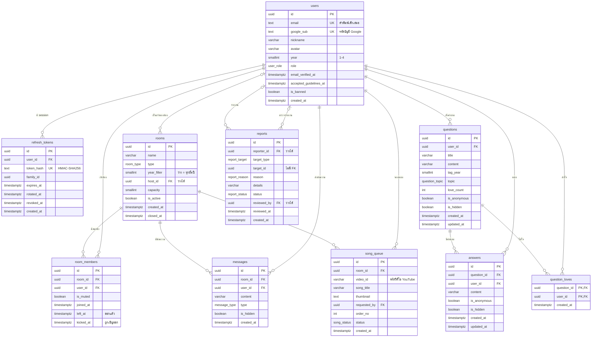

# ฐานข้อมูล (ข้อ 3.5.2 · ตารางที่ 3.2)

- **ระบบฐานข้อมูล:** PostgreSQL เชื่อมต่อผ่าน Prisma 7
  - ตอนพัฒนาใช้ PostgreSQL ในเครื่อง ส่วนบนเว็บจริงใช้ Supabase
- **ที่มาของข้อมูลในเอกสารนี้:** โครงสร้างจริงอยู่ที่ `server/prisma/schema.prisma` ถ้าแก้ไฟล์นั้น ให้แก้เอกสารนี้ด้วย
- **ชื่อตารางและคอลัมน์:**
  - ในโค้ด model ใช้ชื่อแบบ PascalCase/camelCase เช่น `RoomMember.joinedAt`
  - ในฐานข้อมูลเป็น snake_case ตามรูปเล่ม เช่น `room_members.joined_at`
- **เทียบกับรูปเล่ม:** ตารางที่ 3.2 มี 8 ตาราง ระบบจริงเพิ่ม `refresh_tokens` และ `question_loves` และเพิ่มคอลัมน์หลายตัว รายละเอียดอยู่ใน [report-changes.md](report-changes.md) หัวข้อ 3.5.2

## แผนภาพ ER

## ตารางทั้งหมด

| ตาราง | เก็บอะไร | จุดที่ควรรู้ |
|---|---|---|
| `users` | สมาชิก | อีเมลเก็บเป็นตัวพิมพ์เล็กเสมอและไม่เคยส่งให้ผู้ใช้อื่น · ไม่มีรหัสผ่าน (เข้าสู่ระบบด้วย Google) · บัญชีจาก seed ไม่มี `google_sub` · `role` เป็น `moderator` ได้ทางฐานข้อมูลเท่านั้น · `email_verified_at` ว่าง = แถวที่สมัครค้างจากระบบ OTP เดิม ไม่นับเป็นบัญชี |
| `refresh_tokens` | session ของผู้ใช้ | เก็บ hash ไม่เก็บค่าจริง · `family_id` = token ที่หมุนต่อกันมาจากการเข้าสู่ระบบครั้งเดียวกัน · `rotated_at` = แลกเป็น token ใหม่แล้ว · `revoked_at` = ถูกเพิกถอน |
| `rooms` | ห้อง 1-1 / ห้องกลุ่ม / ห้องคาราโอเกะ | `capacity` เป็น 2 สำหรับห้อง 1-1 และ `GROUP_ROOM_MAX` สำหรับห้องอื่น · ไม่เหลือใครหรือผู้ดูแลปิด → `is_active = false` และบันทึก `closed_at` (ระบบไม่ลบแถวห้อง) |
| `room_members` | ใครอยู่ห้องไหน | ออกจากห้องแบบ soft คือบันทึก `left_at` ไม่ลบแถว เพื่อนับสถิติข้อ 4.6 · 1 แถวต่อ 1 คนต่อห้อง เข้าห้องเดิมอีกครั้งใช้แถวเดิม · มี `kicked_at` = เจ้าของห้องเชิญออก กลับเข้าห้องนั้นไม่ได้ |
| `messages` | แชทในห้อง | `type` เป็นข้อความหรือสติกเกอร์ (`content` = key ของสติกเกอร์) · `is_hidden` = ผู้ดูแลซ่อน |
| `questions` | คำถามบนบอร์ด | `love_count` เก็บยอดใจเป็นตัวเลข จึงต้องปรับเองทุกครั้งที่ส่งใจ/เลิกส่งใจ/ลบบัญชี · `is_anonymous` = ไม่เปิดเผยตัวตน (API ไม่ส่ง user id ของผู้ถาม) · `is_hidden` = ผู้ดูแลซ่อน |
| `answers` | คำตอบ | ตอบได้ไม่จำกัดจำนวนคน · `is_anonymous` / `is_hidden` ความหมายเดียวกับคำถาม |
| `question_loves` | ใครส่งใจคำถามไหน | primary key คือ (คำถาม, ผู้ใช้) จึงส่งใจคำถามเดิมซ้ำไม่ได้ |
| `song_queue` | คิวเพลงคาราโอเกะ | `status`: `queued` → `playing` → `done` หรือ `skipped` · ห้องหนึ่งมีเพลง `playing` ได้ทีละเพลง · `order_no` = ลำดับในคิว |
| `reports` | รายงานเนื้อหา/พฤติกรรม | `target_type` + `target_id` ชี้ได้ 5 ประเภท จึงไม่มี foreign key: ถ้าสิ่งนั้นถูกลบ รายงานยังอยู่และแสดงว่า "ถูกลบไปแล้ว" · รายงานสิ่งเดิมซ้ำไม่ได้ (unique: ผู้รายงาน + เป้าหมาย) · `reporter_id` ว่าง = ผู้รายงานลบบัญชีไปแล้ว |

### enum

| ชื่อในฐานข้อมูล | ค่าที่เป็นไปได้ |
|---|---|
| `user_role` | `member`, `moderator` |
| `room_type` | `private` (คุย 1-1), `group` (ห้องกลุ่ม), `karaoke` |
| `message_type` | `text`, `sticker` |
| `question_topic` | `study` (การเรียน), `project` (โปรเจกต์), `internship` (ฝึกงาน/อาชีพ), `life` (ชีวิตมหาวิทยาลัย), `other` |
| `song_status` | `queued`, `playing`, `done`, `skipped` |
| `report_target` | `question`, `answer`, `message`, `user`, `room` |
| `report_reason` | `harassment`, `hate`, `sexual`, `spam`, `self_harm` (มีความเสี่ยงทำร้ายตัวเอง), `other` |
| `report_status` | `pending` (รอตรวจ), `actioned` (จัดการแล้ว), `dismissed` (ไม่พบการทำผิด) |

## ลบข้อมูลแล้วอะไรหายตาม

**ลบบัญชีผู้ใช้** (ผู้ใช้กดลบเองในหน้า "ฉัน"):
- **ข้อมูลที่หายตาม (Cascade):**
  - session และประวัติการเข้าห้อง
  - ข้อความแชท
  - คำถาม พร้อมคำตอบและใจในคำถามนั้น
  - คำตอบ ใจที่ส่ง และเพลงที่จอง
- **ข้อมูลที่ยังอยู่ แต่คอลัมน์ที่ชี้ถึงผู้ใช้กลายเป็นค่าว่าง (SetNull):**
  - `rooms.host_id`
  - `reports.reporter_id`: รายงานยังอยู่ให้ผู้ดูแลจัดการต่อ
  - `reports.reviewed_by`
- **ก่อนลบ `user.service.js` (`deleteAccount`) ทำ 3 อย่าง:**
  - พาออกจากห้องตามปกติ (ย้ายเจ้าของห้องหรือปิดห้อง)
  - เอาเพลงที่จองค้างออกจากคิว
  - ลด `love_count` ของคำถามที่เคยส่งใจ

**ลบคำถาม:** คำตอบและใจของคำถามนั้นหายตาม

**ห้อง:** ระบบปิดห้องด้วย `is_active` ไม่ลบแถว แต่ถ้าลบเองทางฐานข้อมูล สมาชิก ข้อความ และคิวเพลงของห้องจะหายตาม

## ความปลอดภัยในระดับฐานข้อมูล

**CHECK constraint** (อยู่ใน migration `enable_rls` เพราะ Prisma schema เขียนไม่ได้):
- `users.year` อยู่ระหว่าง 1–4
- `users.email` ต้องเป็นตัวพิมพ์เล็ก
- `rooms.year_filter` และ `questions.tag_year` เป็นค่าว่างหรือ 1–4
- `rooms.capacity` อยู่ระหว่าง 2–20
- `questions.love_count` ไม่ติดลบ

**Row Level Security:**
- เปิดทุกตาราง แต่ไม่มี policy จึงปฏิเสธการเข้าถึงจาก role อื่นทั้งหมด
- บน Supabase จึงอ่านตารางผ่าน Data API สาธารณะ (anon key) ไม่ได้
- server ต่อฐานข้อมูลในฐานะเจ้าของตารางจึงไม่ถูกบล็อก (ข้อ 3.5.9 ข้อ 3)

**ข้อมูลส่วนตัว:**
- ข้อมูลผู้ใช้ที่ส่งให้คนอื่น select ด้วย `publicUserSelect` (id, ชื่อเล่น, อวาตาร์, ชั้นปี) แล้วแปลงด้วย `publicUser` ใน `server/src/utils/present.js`
- อีเมลจึงไม่หลุดไปในข้อมูลของคนอื่น

## index

| ตาราง | index | ใช้ตอน |
|---|---|---|
| `rooms` | (`is_active`, `type`, `year_filter`) | รายการห้องที่เปิดอยู่ กรองตามประเภทและชั้นปี |
| `room_members` | unique (`room_id`, `user_id`) · (`user_id`, `left_at`) | หาสมาชิกในห้อง · หาว่าผู้ใช้อยู่ห้องไหน (อยู่ได้ทีละห้อง) |
| `messages` | (`room_id`, `created_at`) | ข้อความล่าสุดของห้อง |
| `questions` | (`created_at`) · (`tag_year`, `topic`) | เรียงคำถามล่าสุด · กรองชั้นปีและหัวข้อ |
| `answers` | (`question_id`, `created_at`) | คำตอบของคำถาม เรียงตามเวลา |
| `song_queue` | (`room_id`, `status`, `order_no`) | คิวเพลงของห้อง |
| `reports` | unique (`reporter_id`, `target_type`, `target_id`) · (`status`, `created_at`) | กันรายงานซ้ำ · รายการรายงานตามสถานะ |
| `refresh_tokens` | unique (`token_hash`) · (`user_id`) · (`family_id`) | หา session จาก cookie · เพิกถอนทุก session ของผู้ใช้ · เพิกถอนทั้งตระกูล |

## ประวัติ migration

| migration | เปลี่ยนอะไร |
|---|---|
| `20260928200000_init` | สร้างตารางทั้งหมด (ตอนนั้นยังมีรหัสผ่านและตาราง `email_otps` ของระบบ OTP ทางอีเมล) |
| `20260928200100_enable_rls` | CHECK constraint และเปิด Row Level Security ทุกตาราง |
| `20260928211209_refresh_token_rotated_at` | เพิ่ม `refresh_tokens.rotated_at` (ช่วงผ่อนผันตอนเปิดหลายแท็บ) |
| `20260929112459_google_login` | เปลี่ยนเป็นเข้าสู่ระบบด้วย Google: ลบ `password_hash`, ตาราง `email_otps` และ enum `otp_purpose` · เพิ่ม `users.google_sub` |
| `20261007183646_room_member_kicked_at` | เพิ่ม `room_members.kicked_at` (เจ้าของห้องเชิญออก) |
| `20261007183708_report_reporter_set_null` | `reports.reporter_id` เป็นค่าว่างได้ (ON DELETE SET NULL) รายงานจึงไม่หายเมื่อผู้รายงานลบบัญชี |

## วิธีแก้โครงสร้างฐานข้อมูล

คำสั่งทั้งหมดรันในโฟลเดอร์ `server/`

1. แก้ `prisma/schema.prisma`
2. สร้างไฟล์ migration แต่ยังไม่ apply: `npx prisma migrate dev --create-only --name <ชื่อสั้น ๆ>`
3. เปิด `prisma/migrations/<เวลา>_<ชื่อ>/migration.sql` เติมคอมเมนต์ภาษาไทยที่หัวไฟล์ว่าเปลี่ยนเพราะอะไร (ดูตัวอย่างใน `google_login`) ถ้าต้องใช้ SQL ที่ Prisma เขียนไม่ได้ (CHECK, RLS) เขียนเพิ่มตอนนี้
4. apply และสร้าง Prisma Client ใหม่: `npm run db:migrate`
5. รันเทสต์ (`npm test`) แล้วแก้เอกสารนี้ [report-changes.md](report-changes.md) (ถ้าต่างจากรูปเล่ม) และ `seed.js` (ถ้าข้อมูลตัวอย่างต้องเปลี่ยน)

**ข้อควรระวัง:**
- **ห้ามแก้ `migration.sql` ที่ apply ไปแล้ว** แม้แต่เพิ่มคอมเมนต์
  - Prisma เก็บ checksum ของไฟล์ไว้ในตาราง `_prisma_migrations`
  - ถ้าไฟล์เปลี่ยน `migrate dev` จะขอ reset ซึ่งลบข้อมูลทั้งหมดในฐาน dev
  - ถ้าต้องอธิบายเพิ่ม ให้เขียนเป็นคอมเมนต์ใน `schema.prisma` แทน
- `--create-only` จะ apply migration ก่อนหน้าที่ยังค้างอยู่ด้วย จึงควรเติมคอมเมนต์ให้เสร็จก่อนสร้าง migration ถัดไป
- **ตรวจว่าฐานข้อมูลตรงกับ schema** (ไม่มีผลลัพธ์ = ตรงกัน): `npx prisma migrate diff --from-config-datasource --to-schema prisma/schema.prisma --script`
- **บนเว็บจริง:** Render รัน `prisma migrate deploy` ทุกครั้งที่ build (`render.yaml`) ซึ่ง apply เฉพาะ migration ใหม่และไม่ลบข้อมูล
- **เทสต์ใช้ฐานแยก:** `talkwithduck_test` (ชื่อฐาน dev ต่อท้าย `_test`) ล้างข้อมูลทุกเทสต์ ไม่แตะฐาน dev
